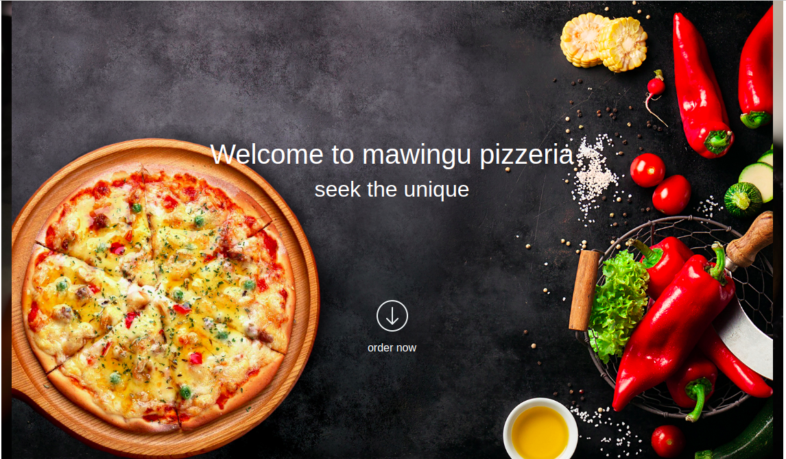

# Mawingu Pizzeria
## Author

[Victor Fereiti Mirgichan]()

## Description

This is a web application for Mawingu pizzeria  which is a pizza restaurant, that allows customers to order pizza online for their preferred pizza depending on size, crust they need and also allows them to input a location which they would love the piza to be delivered to. 

## Screenshot

## Live pages
(https://victor-mirgichan.github.io/mawingu-pizzeria/)

## Technologies used
* HTML
* CSS
* Bootsrap
* JQuery
* Javascript

## support and Contact Information 

If you have any question or contributions that would better this app, please email me at [provic13@gmail.com]

#### licence and copyright informatioN, LICENCED UNDER MIT (https://github.com/victor-mirgichan/mawingu-pizzeria/blob/master/LICENCE)